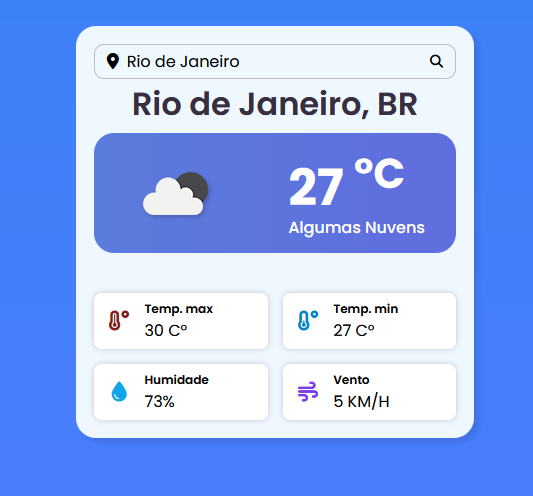
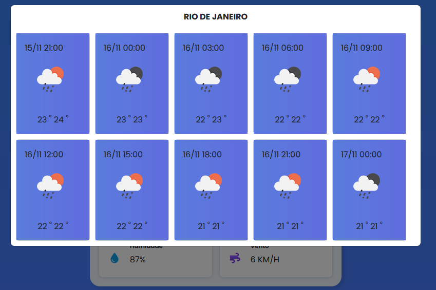

# Integration Code with Open Weather Map API 🚀

Documentation under construction

Register and obtain your API key at:
```shell
https://openweathermap.org/
```

Clone the repository using the following command:
```shell
git clone git@github.com:yuri-spm/laravel_openweather.git
```

Navigate to the Project Directory
```shell
cd laravel_openweather
```


Install Dependencies
```shell
composer dump-autoload
```

Update the .env file with your API key and the base API endpoint:

```shell
API_OPENWEATHER=
OPENWEATHER_BASE_API=
```


Use the following command to build the assets for development:
```shell
npm rum dev
```

After setting up, access the project in your browser at:
```shell
http://laravel_openweather.test
```






